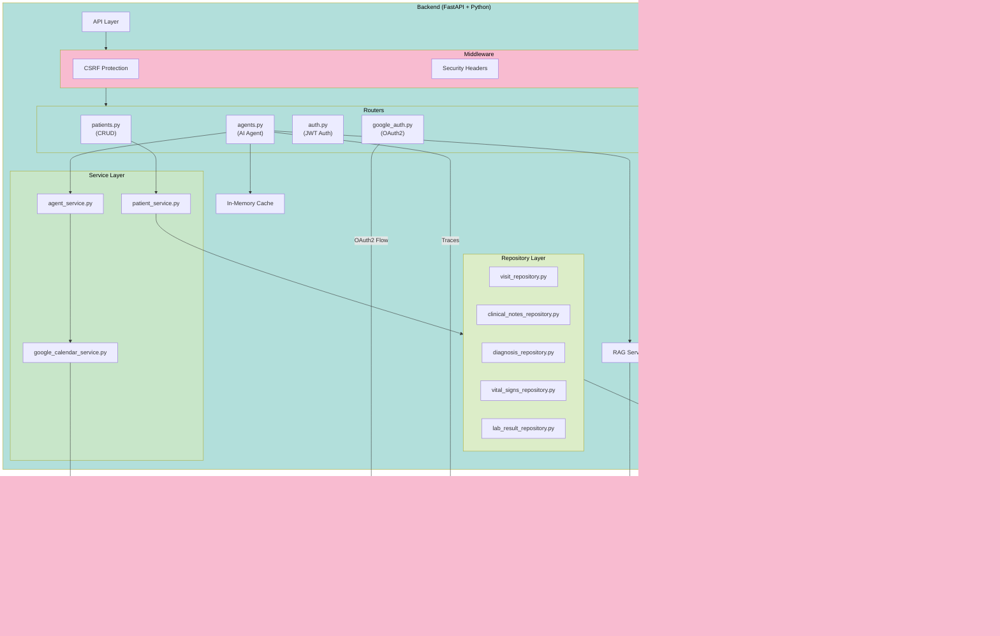

# Healthcare Agent

[](https://www.python.org/)
[](https://fastapi.tiangolo.com/)
[](https://react.dev/)
[](https://www.postgresql.org/)

An AI-powered healthcare agent that assists clinicians with patient management, providing AI-generated clinical briefings, medication recommendations, and automated follow-up visit scheduling with Google Calendar integration.

## Table of Contents

- [Architecture Diagram](#architecture-diagram)
- [Tech Stack](#tech-stack)
- [Features](#features)
- [Prerequisites](#prerequisites)
- [Quick Start](#quick-start)
- [API Endpoints](#api-endpoints)
- [Project Structure](#project-structure)
- [Future Work](#future-work)

## Architecture Diagram



## Tech Stack

### Backend

- **Framework**: FastAPI
- **Database**: PostgreSQL
- **Vector Database**: ChromaDB
- **AI/LLM**: Gemini 2.5 Flash (via Google AI Studio)
- **RAG**: LangChain with ChromaDB embeddings
- **ORM**: psycopg
- **Observability**: Langfuse

### Frontend

- **Framework**: React
- **Language**: TypeScript
- **Build Tool**: Vite
- **Routing**: React Router

## Features

- **Authentication**: JWT-based auth via httpOnly cookies with signup/login/logout flows
- **Patient Management**: Full CRUD for patients, visits, medications, vitals, labs, diagnoses, and allergies
- **Patient Overview**: AI-generated clinical briefings combining structured data with historical clinical notes
- **Recommendations**: AI-powered clinical recommendations based on patient context
- **Medication Recommendations**: AI-powered medication suggestions and alternatives based on patient context
- **Follow-up Scheduling**: Automated visit scheduling with Google Calendar integration via OAuth2
- **RAG-powered Context**: Retrieval-augmented generation using ChromaDB for historical note context
- **Caching**: In-memory caching for improved performance on repeated queries
- **Observability**: Langfuse for monitoring, tracing, and span-level instrumentation
- **Security**: CSRF protection, security headers middleware, rate limiting (5 req/min on login), and per-patient access control
- **Audit Logging**: Every request logged to PostgreSQL with doctor identity, path, status, and duration

## Prerequisites

- [Docker](https://www.docker.com/get-started)
- [Docker Compose](https://docs.docker.com/compose/install/)
- Google AI Studio API key (for AI features)
- Google Cloud Project with Calendar API enabled (for scheduling features)
- [Langfuse account](https://langfuse.com)

## Quick Start

### 1. Clone the Repository

```bash
git clone https://github.com/petarkosic/healthcare-agent
cd healthcare-agent
```

### 2. Configure Environment Variables

```bash
cp .env.example .env
# Edit .env with your API keys
```

#### Environment Variables

| Variable               | Description                               | Default                                                    |
| ---------------------- | ----------------------------------------- | ---------------------------------------------------------- |
| `POSTGRES_USER`        | PostgreSQL username                       | `postgres`                                                 |
| `POSTGRES_PASSWORD`    | PostgreSQL password                       | `postgres`                                                 |
| `POSTGRES_HOST`        | PostgreSQL host                           | `postgres`                                                 |
| `POSTGRES_PORT`        | PostgreSQL port                           | `5432`                                                     |
| `POSTGRES_DB`          | Database name                             | `healthcare_agent`                                         |
| `JWT_SECRET_KEY`       | Secret key for JWT signing                | generate with `openssl rand -hex 32`                       |
| `SECURE_COOKIES`       | Set `true` in production (HTTPS required) | `false`                                                    |
| `ALLOWED_ORIGINS`      | Comma-separated extra CORS origins        | -                                                          |
| `API_KEY`              | Google AI Studio API key                  | -                                                          |
| `BASE_URL`             | OpenAI-compatible API endpoint            | `https://generativelanguage.googleapis.com/v1beta/openai/` |
| `GOOGLE_CLIENT_ID`     | Google OAuth2 client ID                   | -                                                          |
| `GOOGLE_CLIENT_SECRET` | Google OAuth2 client secret               | -                                                          |
| `GOOGLE_REDIRECT_URI`  | OAuth2 redirect URI                       | -                                                          |
| `FRONTEND_URL`         | Frontend origin for OAuth popup messages  | `http://localhost:3000`                                    |
| `LANGFUSE_SECRET_KEY`  | Langfuse secret key                       | -                                                          |
| `LANGFUSE_PUBLIC_KEY`  | Langfuse public key                       | -                                                          |
| `LANGFUSE_BASE_URL`    | Langfuse base URL                         | `https://cloud.langfuse.com`                               |

### 3. Run with Docker Compose

#### Development

```bash
docker compose -f docker-compose.yml -f docker-compose.dev.yml up --build
```

Access the application at:

- Frontend: http://localhost:3000
- Backend API: http://localhost:8000
- API Documentation: http://localhost:8000/docs

#### Production

```bash
docker compose -f docker-compose.yml -f docker-compose.prod.yml up --build
```

Access the application at:

- Frontend: http://localhost:8080
- Backend API: http://localhost:8000
- API Documentation: http://localhost:8000/docs

### 4. Google Calendar Setup (Optional)

For follow-up scheduling features:

1. Go to [Google Cloud Console](https://console.cloud.google.com/)
2. Create a project and enable the Google Calendar API
3. Create OAuth 2.0 credentials (Web application)
4. Add your redirect URI to the authorized redirect URIs (e.g. `http://localhost:8000/api/auth/google/callback`)
5. Set `GOOGLE_CLIENT_ID`, `GOOGLE_CLIENT_SECRET`, `GOOGLE_REDIRECT_URI`, and `FRONTEND_URL` in `.env`
6. Connect Google Calendar from the Settings modal in the app to complete the OAuth flow

## API Endpoints

### Health

| Method | Endpoint  | Description  |
| ------ | --------- | ------------ |
| GET    | `/health` | Health check |

### Authentication

| Method | Endpoint                     | Description                         |
| ------ | ---------------------------- | ----------------------------------- |
| POST   | `/api/auth/signup`           | Register a new doctor               |
| POST   | `/api/auth/login`            | Login (rate-limited: 5 req/min)     |
| GET    | `/api/auth/me`               | Get current authenticated doctor    |
| POST   | `/api/auth/logout`           | Logout and clear auth cookies       |
| GET    | `/api/auth/google/authorize` | Initiate Google Calendar OAuth flow |
| GET    | `/api/auth/google/callback`  | Google OAuth2 callback              |
| GET    | `/api/auth/google/status`    | Check Google Calendar connection    |

### Patients

| Method | Endpoint                                          | Description                       |
| ------ | ------------------------------------------------- | --------------------------------- |
| GET    | `/api/patients`                                   | List all patients for doctor      |
| POST   | `/api/patients`                                   | Create a new patient              |
| GET    | `/api/patients/search?patient_serial_number=`     | Search patient by serial number   |
| GET    | `/api/patients/{patient_serial_number}`           | Get full patient profile          |
| POST   | `/api/patients/visits`                            | Start a new visit                 |
| PUT    | `/api/patients/visits`                            | Update a visit                    |
| POST   | `/api/patients/{patient_serial}/notes`            | Add clinical note (AI summarized) |
| POST   | `/api/patients/{patient_serial}/medications`      | Add medication                    |
| PUT    | `/api/patients/{patient_serial}/medications/{id}` | Update medication                 |
| DELETE | `/api/patients/{patient_serial}/medications/{id}` | Delete medication                 |
| POST   | `/api/patients/{patient_serial}/vitals`           | Add vital signs                   |
| POST   | `/api/patients/{patient_serial}/labs`             | Add lab result                    |
| POST   | `/api/patients/{patient_serial}/diagnoses`        | Add diagnosis                     |
| PUT    | `/api/patients/{patient_serial}/allergies`        | Update allergies                  |

### AI Agents

| Method | Endpoint                                | Description                     |
| ------ | --------------------------------------- | ------------------------------- |
| GET    | `/api/agents/overview/{patient_serial}` | Get AI patient overview         |
| POST   | `/api/agents/recommendations`           | Get AI clinical recommendations |
| POST   | `/api/agents/medications`               | Get medication suggestions      |
| POST   | `/api/agents/schedule-followup`         | Schedule follow-up visit        |

## Project Structure

```bash
healthcare-agent/
├── client/                         # React frontend
│   ├── src/                        # React source
│   ├── Dockerfile.dev              # Dev container definition
│   ├── Dockerfile.prod             # Prod container definition
│   └── nginx.conf                  # Nginx config for prod
├── server/                         # FastAPI backend
│   ├── db/                         # Database connection manager
│   ├── middleware/                 # HTTP middleware
│   ├── models/                     # Pydantic models
│   ├── rag/                        # RAG service (ChromaDB)
│   ├── repositories/               # Data access layer
│   ├── routers/                    # API route handlers
│   ├── services/                   # Business logic layer
│   ├── utils/                      # Utility functions
│   ├── Dockerfile.dev              # Dev container definition
│   ├── Dockerfile.prod             # Prod container definition
│   └── main.py                     # FastAPI app + middleware setup
├── db/
│   └── data/                       # SQL initialization scripts
├── nginx.conf                      # Reverse proxy config (prod)
├── docker-compose.yml              # Base compose config
├── docker-compose.dev.yml          # Dev environment config
├── docker-compose.prod.yml         # Prod environment config
├── .env.example                    # Environment variables template
└── pyproject.toml                  # Python project config
```

## Future Work

Planned improvements:

- [x] **Observability**: Tracing, metrics and structured logging
- [x] **Authentication & Authorization**: JWT-based auth with httpOnly cookies, CSRF protection, and per-patient access control
- [x] **Audit Logging**: Every request logged to PostgreSQL with doctor identity, path, status code, and duration
- [ ] **Performance Optimization**: Implement better caching and optimization
