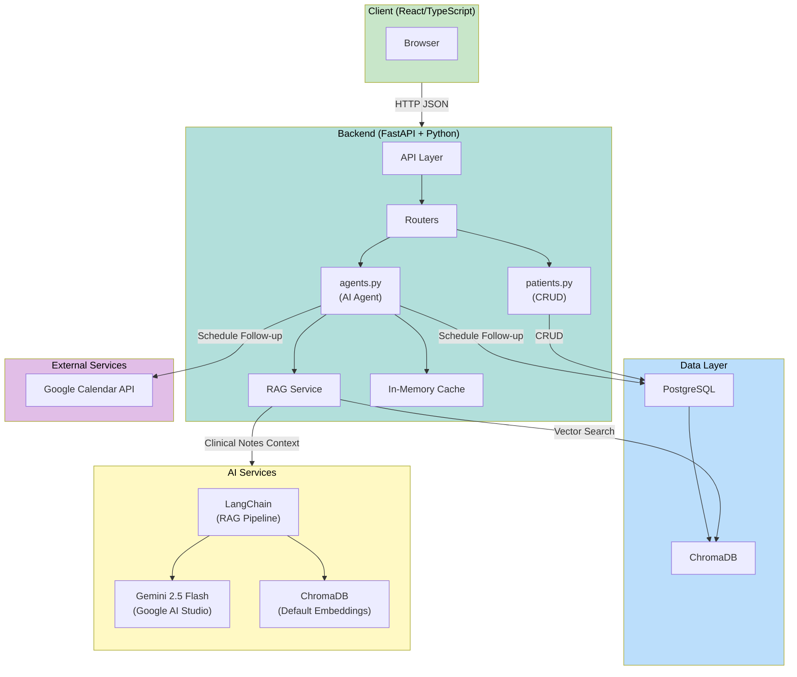

# Healthcare Agent

[](https://www.python.org/)
[](https://fastapi.tiangolo.com/)
[](https://react.dev/)
[](https://www.postgresql.org/)

An AI-powered healthcare agent that assists clinicians with patient management, providing AI-generated clinical briefings, medication recommendations, and automated follow-up visit scheduling with Google Calendar integration.

## Table of Contents

- [Architecture Diagram](#architecture-diagram)
- [Tech Stack](#tech-stack)
- [Features](#features)
- [Prerequisites](#prerequisites)
- [Quick Start](#quick-start)
- [API Endpoints](#api-endpoints)
- [Project Structure](#project-structure)
- [Future Work](#future-work)

## Architecture Diagram



## Tech Stack

### Backend

- **Framework**: FastAPI
- **Database**: PostgreSQL
- **Vector Database**: ChromaDB
- **AI/LLM**: Gemini 2.5 Flash (via Google AI Studio)
- **RAG**: LangChain with ChromaDB embeddings
- **ORM**: psycopg

### Frontend

- **Framework**: React
- **Language**: TypeScript
- **Build Tool**: Vite
- **Routing**: React Router

## Features

- **Patient Overview**: AI-generated clinical briefings combining structured data with historical clinical notes
- **Recommendations**: AI-powered recommendations based on patient context
- **Medication Recommendations**: AI-powered medication suggestions and alternatives based on patient context
- **Follow-up Scheduling**: Automated visit scheduling with Google Calendar integration
- **RAG-powered Context**: Retrieval-augmented generation using ChromaDB for historical note context
- **Caching**: In-memory caching for improved performance on repeated queries

## Prerequisites

- [Docker](https://www.docker.com/get-started)
- [Docker Compose](https://docs.docker.com/compose/install/)
- Google AI Studio API key (for AI features)
- Google Cloud Project with Calendar API enabled (for scheduling features)

## Quick Start

### 1. Clone the Repository

```bash
git clone https://github.com/petarkosic/healthcare-agent
cd healthcare-agent
```

### 2. Configure Environment Variables

```bash
cp .env.example .env
# Edit .env with your API keys
```

#### Environment Variables

| Variable            | Description                    | Default                                                    |
| ------------------- | ------------------------------ | ---------------------------------------------------------- |
| `POSTGRES_USER`     | PostgreSQL username            | `postgres`                                                 |
| `POSTGRES_PASSWORD` | PostgreSQL password            | `postgres`                                                 |
| `POSTGRES_HOST`     | PostgreSQL host                | `postgres`                                                 |
| `POSTGRES_PORT`     | PostgreSQL port                | `5432`                                                     |
| `POSTGRES_DB`       | Database name                  | `healthcare_agent`                                         |
| `API_KEY`           | Google AI Studio API key       | -                                                          |
| `BASE_URL`          | OpenAI-compatible API endpoint | `https://generativelanguage.googleapis.com/v1beta/openai/` |

### 3. Run with Docker Compose

#### Development

```bash
docker compose -f docker-compose.yml -f docker-compose.dev.yml up --build
```

Access the application at:

- Frontend: http://localhost:3000
- Backend API: http://localhost:8000
- API Documentation: http://localhost:8000/docs

#### Production

```bash
docker compose -f docker-compose.yml -f docker-compose.prod.yml up --build
```

Access the application at:

- Frontend: http://localhost:8080
- Backend API: http://localhost:8000
- API Documentation: http://localhost:8000/docs

### 4. Google Calendar Setup (Optional)

For follow-up scheduling features:

1. Go to [Google Cloud Console](https://console.cloud.google.com/)
2. Create a project and enable the Google Calendar API
3. Create OAuth 2.0 credentials (Desktop application)
4. Download the credentials JSON file
5. Save it as `server/routers/credentials.json`

## API Endpoints

### Patients

| Method | Endpoint                                      | Description                  |
| ------ | --------------------------------------------- | ---------------------------- |
| GET    | `/api/patients`                               | List all patients            |
| GET    | `/api/patients/{patient_serial_number}`       | Get patient by serial number |
| POST   | `/api/patients/visits`                        | Start a new visit            |
| PUT    | `/api/patients/visits`                        | Update a visit               |
| POST   | `/api/patients/{patient_serial_number}/notes` | Send clinical notes          |

### AI Agents

| Method | Endpoint                                       | Description                |
| ------ | ---------------------------------------------- | -------------------------- |
| GET    | `/api/agents/overview/{patient_serial_number}` | Get AI patient overview    |
| POST   | `/api/agents/recommendations`                  | Get AI recommendations     |
| POST   | `/api/agents/medications`                      | Get medication suggestions |
| POST   | `/api/agents/schedule-followup`                | Schedule follow-up visit   |

## Project Structure

```bash
healthcare-agent/
├── client/                   # React frontend
│   ├── src/                  # React source
│   ├── Dockerfile.dev        # Dev container definition
│   ├── Dockerfile.prod       # Prod container definition
│   └── nginx.conf            # Nginx config for prod
├── server/                   # FastAPI backend
│   ├── models/               # Pydantic models
│   ├── rag/                  # RAG service (ChromaDB)
│   ├── routers/              # API route handlers
│   │   ├── agents.py         # AI agent endpoints
│   │   └── patients.py       # Patient endpoints
│   ├── utils/                # Utility functions
│   ├── Dockerfile.dev        # Dev container definition
│   ├── Dockerfile.prod       # Prod container definition
│   └── main.py               # FastAPI app
├── db/
│   └── data/                 # SQL initialization scripts
├── nginx.conf                # Reverse proxy config (prod)
├── docker-compose.yml        # Base compose config
├── docker-compose.dev.yml    # Dev environment config
├── docker-compose.prod.yml   # Prod environment config
├── .env.example              # Environment variables template
└── pyproject.toml            # Python project config
```

## Future Work

Planned improvements:

- [ ] **Observability**: Tracing, metrics and structured logging
- [ ] **Authentication & Authorization**: Add secure API access with role-based permissions
- [ ] **Audit Logging**: Implement HIPAA-compliant audit trails
- [ ] **Performance Optimization**: Implement better caching and optimization
